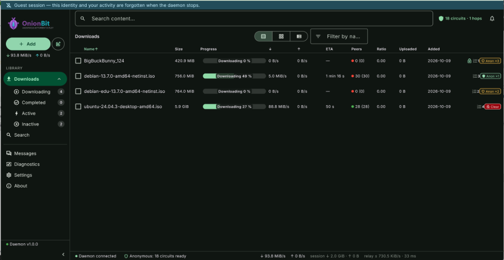

<div align="center">


### Anonymous BitTorrent client, native in Rust

**A full Rust port of [Tribler](https://github.com/Tribler/tribler) — BitTorrent over onion-routed, multi-hop circuits.**

[](LICENSE)
[](https://www.rust-lang.org/)
[](https://flutter.dev/)
[](https://github.com/laurentgeynet-ux/OnionBit/actions/workflows/ci.yml)
[](https://github.com/laurentgeynet-ux/OnionBit/releases)
[]()

</div>

---

## What is OnionBit?

OnionBit is a BitTorrent client where **anonymity is built into the protocol**, not bolted on.
It is a native Rust port of [Tribler](https://github.com/Tribler/tribler) — the anonymous
BitTorrent daemon originally written in Python — reimplemented as a fast, embeddable
Rust engine with a cross-platform Flutter UI.

Instead of connecting directly to the swarm, OnionBit can route all BitTorrent traffic
through **multi-hop onion circuits** built on a port of the IPv8 overlay protocol, the
same design Tribler pioneered:

- 🔗 **Multi-hop encrypted circuits** — up to 3 hops between you and the swarm
- 🧅 **Onion routing** — each relay only knows its neighbors, never the endpoints
- 🌱 **Hidden seeding** — seed content without exposing your IP address
- 💬 **Decentralized anonymous messaging** — end-to-end encrypted chat riding
  the same onion fabric: no server, no account, your public key is your address
- 🤝 **OnionBit trust layer** — signed capability handshakes, curator attestations
  and a bilateral signed ledger between peers ([ADR-0015](#the-onionbit-extension-layer-adr-0015))
- 🕶️ **Padded encrypted envelopes (OBF)** — optional traffic-shape hardening between
  OnionBit peers, negotiated per capability bit
- 🌱 **Self-sovereign identity** — one 24-word recovery phrase (English *or*
  French) backs up your entire identity; ephemeral guest sessions and
  optional password-sealed at-rest storage included
  ([ADR-0016](docs/architecture/decisions/0016-identite-portable.md))
- 🥷 **Stealth anti-censorship mode** — a dedicated transport with no static
  protocol marker on the wire: Elligator2-encoded handshake, uniform silence
  under active probing, Tor-style `onionbit-bridge://` invitation links
  ([ADR-0017](docs/architecture/decisions/0017-transport-furtif-anti-censure.md))
- 🔍 **Decentralized search** — content discovery through the overlay, no central index
- 🛡️ **Kill switch & leak protection** — no clearnet fallback, no DNS/UDP leaks
- 🦀 **Pure Rust core** — memory-safe, single binary, embeddable via REST API

> **Status: beta.** The engine is under active development and validated against the
> real Tribler network (Tribler 8.x interop testbench) — including fail-closed
> transport under injected failures (see `docs/P0-transport-manifest.md`). Not yet
> recommended for high-stakes anonymity. Onion routing reduces network-level
> linkability; it does not eliminate all privacy risks — see the
> [threat model](docs/THREAT-MODEL.md).

## Proven interoperability

OnionBit has completed **bidirectional hidden-service transfers with unmodified
Tribler 8.4.3**:

- Tribler downloads from an OnionBit anonymous seeder — and vice versa.
- Controlled **2-hop and 3-hop** transfers completed in both directions.
- Seeder, introduction-point and bootstrap-node **kill/recovery scenarios**
  completed with verified content integrity.
- Real-network downloads over live Tribler relays and the public DHT.

Every transfer is checked twice: BitTorrent piece hashing, then an independent
SHA-256 of the received file. Full scenario table, failure semantics and
reproduction scripts: [**interoperability evidence**](docs/interop/README.md).

## Decentralized anonymous messaging

Beyond torrents, OnionBit carries **end-to-end messaging over the same onion
fabric** — an OnionBit-only extension
([ADR-0011](docs/architecture/decisions/0011-messagerie-anonyme-e2e.md)).
No server, no account, no phone number: **your public key is your address.**

```
        you                                            contact
         │  announce intro points on swarm                │
         │  messaging_hash(own_pk) ──────────► (DHT)      │
         │                                                │
         │  ◄─── resolve pk → intro point ──── connect(pk)
         │  ◄══════ create-e2e rendezvous circuit ════════►│
         │  ◄── hello lands in `pending` ─── accept ─────▶│
         │  ◄════════ signed, e2e-encrypted frames ════════►
```

- 🔑 **Identity = your IPv8 keypair** — an Ed25519 (`libnacl`) key derived
  from a root seed (`identity_seed.bin`, atomic writes, `0600` on Unix).
  Back it up once as a 24-word recovery phrase or move it between devices
  via the password-sealed `OBID` export (*Settings → Identity*), then
  restore your contacts with the `OBV1` vault.
  Sharing a contact means exchanging public keys, nothing else.
- 🧅 **Reachable without an IP** — each identity announces introduction
  points on its own hidden swarm (`messaging_hash(pk)`); contacts resolve it
  through DHT/PEX and open a rendezvous e2e circuit. Relays forward cells
  without learning who talks to whom.
- 🔐 **Two independent crypto layers** — the e2e handshake yields *transport*
  session keys; the application derives its own directional `send`/`recv`
  keys via HKDF-SHA256 (domain `"onionbit messaging v1"`). Compromising one
  layer does not unlock the other.
- ✍️ **Every frame signed** — versioned canonical bencode (32 KiB bound),
  Ed25519-signed by the sender and verified against the key that defines the
  swarm: nobody who merely knows the swarm can write in your name.
- ✋ **Consent before anything** — an unknown sender lands in a bounded
  `pending` queue: accept, refuse or block. No consent → no circuit → no
  delivery.
- 📬 **Honest delivery semantics** — offline contact ⇒ immediate visible
  `failed` state, never a silent queue. Contacts and messages persist
  locally in plaintext SQLite (endpoint compromise is outside the threat
  model); optional per-contact retention with real deletion
  (`secure_delete` wipes bodies before `DELETE`).

Toggle: *Settings → Anonymity → Anonymous messaging* (on by default; applied
on restart). REST surface: `GET/POST /api/messaging/*` + SSE events.

## The OnionBit extension layer (ADR-0015)

Wire compatibility with Tribler 8.x is a hard boundary: the legacy protocol is
**never modified**. Everything new lives in a dedicated extension community
(`OnionbitExtCommunity`, own community id) spoken **only between OnionBit
peers** — a Tribler node simply never hears it.

- 🙋 **Signed capability `hello`** — peers advertise feature bits
  (`CAP_OBF_V1`, `CAP_MSG_V1`, …) in an Ed25519-signed handshake; a forged or
  replayed hello is rejected at the wire.
- ⭐ **Signed curator attestations** — any identity can `endorse`/`flag` a
  torrent or a peer (`kind=identity`); attestations gossip between OnionBit
  peers and feed a **local** trust score. Search results show trust badges and
  you can *follow curators* — reputation without a blockchain.
- 📒 **Bilateral signed ledger** — two peers can record mutual obligations
  (`PROPOSE` → `SEAL`, heads, rejects, fork proofs). It is *not* Tribler's
  retired TrustChain: no global state, no consensus, just signed
  accounting between two endpoints — groundwork against free-riding.
- 🕶️ **`OBF` padded envelopes** — opt-in encrypted wrapping of extension frames
  (HKDF `ext-obf/v1`, size-class padding) negotiated via `CAP_OBF_V1`;
  content *and* shape hidden from a passive observer, never sent to legacy peers.
- 🤝 **Trust-gated messaging** — optional consent gates: auto-admit endorsed
  contacts, drop flagged ones, refuse tunnel debtors (`messaging_consent_*`,
  all off by default). Local blocks always win.
- 📇 **Encrypted contact vault (`OBV1`)** — export your contact list (public
  keys + local aliases) sealed to *your own* key; restore on another device.
  Nothing public, nothing on a server.
- 🧳 **Portable identity (`OBID`)** — export/import the identity key as an
  argon2id + ChaCha20-Poly1305 sealed blob — or back up the root seed as a
  24-word BIP39 phrase that regenerates keypair *and* stealth bridge key;
  `restart_required` swap, no account needed
  ([ADR-0016](docs/architecture/decisions/0016-identite-portable.md)).

Discovery: `GET /api/ipv8/ext` lists OnionBit peers with full public keys —
the messaging UI suggests `msg_v1` peers you haven't added yet. Full spec:
[ADR-0015](docs/architecture/decisions/0015-extensions-onionbit-legacy-tribler.md).
For anti-censorship — traffic with *no static protocol marker at all* — see
the dedicated [stealth mode](#stealth-mode--anti-censorship-adr-0017).

## A self-sovereign identity (ADR-0016)

No account, no server — and your identity is no longer tied to one device
nor exposed as a bare file:

- 🌱 **One seed, one phrase** — a 32-byte root seed (`identity_seed.bin`)
  derives *everything* through domain-separated HKDF: your IPv8 keypair
  **and** your stealth bridge key. Back it up once as a **24-word BIP39
  recovery phrase** — official wordlists vendored in English *and* French,
  the decoder accepts both — and that phrase restores the complete identity
  on any device.
- 🚪 **No throwaway key on the wire** — on first launch, a UI-spawned daemon
  stops at an `identity_pending` gate: *create*, *restore* (phrase or
  `OBID`) or *go guest* **before any packet is signed**. Headless daemons
  still auto-generate — a bridge must never block unattended.
- 👻 **Guest sessions** — a fully ephemeral identity held in memory only:
  nothing is written to disk, history stays `:memory:`, and the identity
  ceases to exist on shutdown. Two guest sessions are unlinkable — at the
  cost of being a permanent stranger (no accumulated trust).
- 🔒 **Optional at-rest sealing** — encrypt the seed into an `OBSK` blob
  (argon2id RFC 9106 → ChaCha20-Poly1305) and the daemon boots `locked`:
  the API is up but nothing identity-bound runs until a rate-limited
  `unlock`. Refused on `bridge`/`gateway` roles — a bridge must reboot
  without supervision. Lost password → restore from the phrase.
- 🧓 **Existing installs unaffected** — legacy nodes keep their raw keypair
  (`seeded: false`); changing keys means a new identity, so re-keying is
  never forced.

Full spec and migration path:
[ADR-0016](docs/architecture/decisions/0016-identite-portable.md).

## Stealth mode — anti-censorship (ADR-0017)

`OBF` hides the *content* of extension frames — but a classifying censor can
still recognize "OnionBit" from the very first datagram. **Stealth mode
removes every static protocol marker**: no community prefixes, no cleartext
keys or signatures, no recognizable handshake — a transport measured against
fingerprinting oracles, not merely declared stealthy.

Stealth is a **dedicated, opt-in mode**: stealth and legacy Tribler interop
cannot coexist on one node (legacy walk traffic would betray the protocol),
and hybrid configs are refused at startup on every path. The network runs
on three roles:

| Role | What it does |
| :--- | :--- |
| `client` | the censored node — all cleartext interfaces off, only the morphed transport toward bridges |
| `bridge` | entry gate — accepts stealth handshakes; its `onionbit-bridge://` invitation link is distributed out-of-band |
| `gateway` | stealth transport **plus** public BitTorrent exit — the role that makes the global swarm reachable from inside the censored zone |

- 🎫 **Bridge invitation links** — `onionbit-bridge://<ip>:<port>#<bridge_pk>`,
  shared out-of-band like Tor bridges. The bridge key serves admission and
  anti-probing; your OnionBit identity is only revealed *inside* the
  authenticated tunnel.
- 🌀 **No static wire marker** — an `ntor`-style authenticated handshake in
  the very first datagram; ephemeral X25519 keys travel as **Elligator2
  representatives** (indistinguishable from uniform randomness); frame
  counters masked inside the AEAD; additive padding clamped under a
  1280-byte MTU so nothing fragments.
- 🧱 **Uniform silence under probing** — malformed, forged or replayed
  datagrams get *zero* response, whatever the cause (no probing oracle),
  with amplification strictly ≤ 1 and pre-DH CPU budgets both per-IP and
  global.
- 🔁 **Handshake anti-replay** — authenticated timestamps (±90 s window)
  plus a bounded sliding filter of seen ephemeral keys: a captured first
  datagram can never force a response.
- 🛡️ **Fail-closed kill switch** — never a cleartext datagram, even on
  packet loss, timeouts, NAT rebinding or session expiry. Optional random
  cover traffic smooths idle periods.
- 🐌 **Anti-scraping peer discovery** — bridges introduce stealth peers via
  `INTRO` messages *inside* the tunnel, in a graduated sequence: a seed
  budget for newcomers, expansion gated on bilateral ledger reputation —
  one leaked link cannot enumerate the bridge network.
- 📡 **Everything still works inside** — onion circuits, hidden seeding,
  e2e messaging and the whole ADR-0015 extension layer run unchanged over
  the morphed transport. Only clearnet discovery, the public DHT and
  direct BitTorrent are off (public exit exists only on `gateway`).

Validated by measurement, not decree: `bench_stealth_fingerprint.ps1` runs
two real stealth daemons through a UDP tap proxy — **9/9 oracles PASS**
(probing silence, amplification 0, zero legacy marker or constant prefix,
≈8 bits/byte entropy, sessions surviving floods, impairments, bridge
restarts and port rebinding). Honest limits: traffic *volume* stays a
signal, blanket UDP throttling breaks the transport, and distributing the
first bridge link remains a social problem — see
[ADR-0017](docs/architecture/decisions/0017-transport-furtif-anti-censure.md)
and [docs/security/fingerprinting.md](docs/security/fingerprinting.md).

## Screenshots

| Downloads — multi-hop anonymity badges | Diagnostics — live circuits & relays |
| :---: | :---: |
|  |  |

| Decentralized search | Settings & dark mode |
| :---: | :---: |
|  |  |

*UI in English and French (System / English / Français in Settings → Appearance).*

## Architecture

```
┌─────────────────┐  ┌──────────────┐  ┌────────────────────┐
│  Flutter UI     │  │     CLI      │  │  3rd-party tools   │
│  (all platforms)│  │              │  │                    │
└────────┬────────┘  └──────┬───────┘  └─────────┬──────────┘
         └──────────────────┼────────────────────┘
                            │ REST + SSE (loopback by default)
┌───────────────────────────▼────────────────────────────────┐
│                    Control plane (axum)                    │
├────────────────────────────────────────────────────────────┤
│  Domain core — sessions, discovery, channels, settings     │
├──────────────┬──────────────┬───────────────┬──────────────┤
│ BitTorrent   │ IPv8 overlay │ Tunnel comm.  │ SQLite store │
│ (librqbit)   │ (port)       │ (onion rout.) │              │
├──────────────┴──────────────┴───────────────┴──────────────┤
│  Network policy — anti-SSRF · exit policy · kill switch    │
└────────────────────────────────────────────────────────────┘
```

- **BitTorrent engine** — built on [librqbit](https://github.com/ikatson/rqbit) (Apache-2.0):
  bencode, peer-wire, mainline DHT (BEP 5), uTP, trackers.
- **Anonymity layer** — a Rust port of `pyipv8` + `TunnelCommunity`: overlay discovery,
  onion circuits, hidden services, verified against live Tribler nodes.
- **Control plane** — REST + SSE API on loopback by default; the UI, CLI and any
  third-party tool all go through the same door.
- **UI** — Flutter, one codebase for Windows, Linux, macOS, Android, iOS and Web.
  The web build is served **same-origin by the daemon itself**
  (`http://127.0.0.1:<port>/`, ADR-0012) — same UI in your browser, no CORS,
  `/api/*` still behind the API key.

## Getting started

> Prebuilt packages are on the
> [Releases](https://github.com/laurentgeynet-ux/OnionBit/releases) page:
>
> - **Windows x64** — `OnionBit-0.9.4-beta-windows-x64.zip`: unzip, run
>   `OnionBit.exe` — it starts the daemon automatically. Prefer a browser?
>   `OnionBit Web.lnk` opens the same UI at `http://127.0.0.1:8085/` (API
>   key in `state\configuration.json`).
> - **Windows ARM64** — `OnionBit-0.9.4-beta-windows-arm64-headless.zip`: daemon + CLI
>   (headless — no native Flutter ARM64 build yet; use the web UI in your
>   browser).
> - **Linux x64** — `onionbit_0.9.4-beta_amd64.deb` (Debian/Ubuntu/Mint) or
>   `OnionBit-0.9.4-beta-linux-x64.tar.gz`: daemon + CLI + web UI, optional
>   `systemctl --user enable --now onionbit-daemon`.
>
> Other platforms (macOS, Android, iOS): build from source
> (see [docs/BUILDING.md](docs/BUILDING.md)).

**Prerequisites:** Rust stable, Flutter stable (UI only).

```bash
# Daemon (control plane + engine)
cargo build --release -p onionbit-daemon
./onionbit-daemon

# CLI
cargo run -p onionbit-cli -- downloads list

# Flutter UI
cd app && flutter run -d windows   # or linux / chrome / android
```

The daemon exposes `http://127.0.0.1:8085` (loopback only by default) — the same
endpoint the UI and CLI consume. Full build & packaging notes:
[docs/BUILDING.md](docs/BUILDING.md).

## Security model

Anonymity tooling fails quietly. OnionBit treats leak prevention as a hard invariant:

- **No clearnet fallback** — anonymous downloads never silently degrade to direct connections
- **Kill switch** — traffic halts when circuits collapse
- **Stealth kill switch** — in stealth mode, *no cleartext datagram ever leaves
  the socket*, even on loss, timeout, NAT rebinding or session expiry
- **Probing resistance** — stealth nodes answer unauthenticated traffic with
  uniform silence; response amplification is capped at ≤ 1
- **Anti-SSRF & loopback isolation** — the API cannot be coerced into reaching internal services
- **Exit policy enforcement** — exit nodes honor a strict policy
- **Sandboxed trackers/DHT** — in anonymous mode, tracker and DHT traffic rides inside the tunnel

See [SECURITY.md](SECURITY.md) for reporting and the threat model.

## Roadmap

| Milestone | Status |
| :--- | :--- |
| BitTorrent engine (librqbit integration) | ✅ |
| REST + SSE control plane, CLI | ✅ |
| IPv8 overlay port (discovery, communities, DHT) | ✅ |
| Onion circuits + hidden seeding | ✅ |
| Live interop with Tribler 8.x nodes | ✅ |
| Flutter UI (desktop first) | ✅ |
| Web UI served by the daemon (same-origin) | ✅ |
| In-app update check (GitHub releases probe) | ✅ |
| Anonymous e2e messaging over hidden services (ADR-0011) | ✅ |
| OnionBit extension layer: signed hello, attestations, ledger, OBF (ADR-0015) | ✅ |
| Trust-gated messaging + `OBV1` contact vault (ADR-0015 §9) | ✅ |
| Seed identity: HKDF root seed + 24-word BIP39 phrase (EN/FR), guest & locked modes, `OBID` (ADR-0016) | ✅ |
| Stealth transport: morphed wire format, bridge links, anti-probing & anti-scraping (ADR-0017) | ✅ |
| Latest tagged release | ✅ [`v0.9.4-beta`](https://github.com/laurentgeynet-ux/OnionBit/releases/tag/v0.9.4-beta) |
| Linux packages (.deb + tar.gz) | ✅ |
| Windows ARM64 package (headless) | ✅ |
| Mobile execution model (Android/iOS) | 📋 |
| macOS package, native Linux UI | 📋 |

## Contributing

Contributions welcome — see [CONTRIBUTING.md](CONTRIBUTING.md). Big-ticket items:
IPv8 protocol conformance, circuit crypto, Flutter UI, interop testing.

## Acknowledgements

- **[Tribler](https://github.com/Tribler/tribler)** — the original anonymous BitTorrent
  client (Delft University of Technology). OnionBit ports its architecture and
  protocols; no Python source is copied verbatim.
- **[librqbit / rqbit](https://github.com/ikatson/rqbit)** — the excellent Rust
  BitTorrent engine underneath.
- **[pyipv8](https://github.com/Tribler/py-ipv8)** — reference implementation of the
  IPv8 overlay protocol.

## License

Copyright (C) 2026 Laurent Geynet ([@Loulach](https://github.com/laurentgeynet-ux))

[GPL-3.0-or-later](LICENSE) — inherited from Tribler. OnionBit is a derivative work
of Tribler's GPL-3.0 codebase at the architecture/behavior level.

---

<div align="center">
<b>OnionBit</b> — peel the layers, not your privacy. 🧅
</div>
