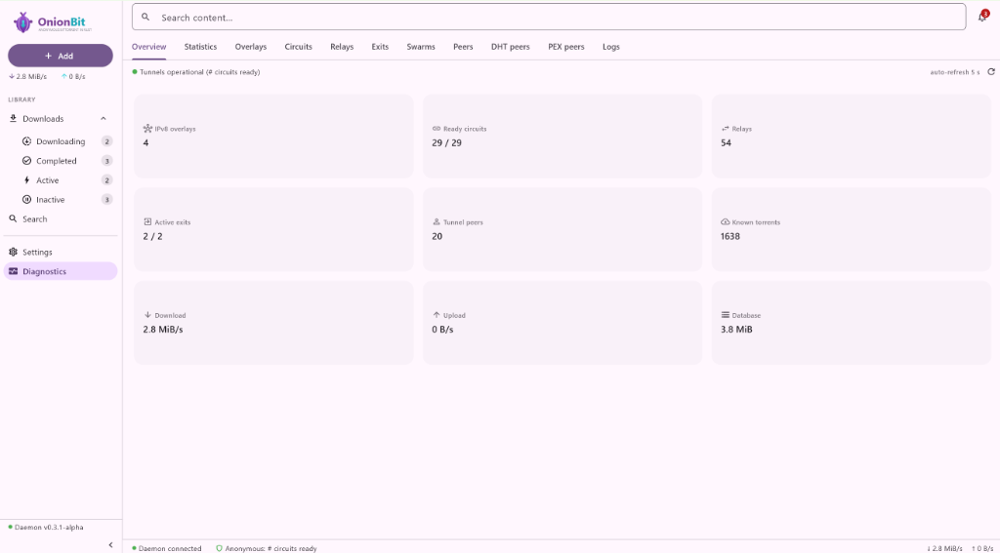
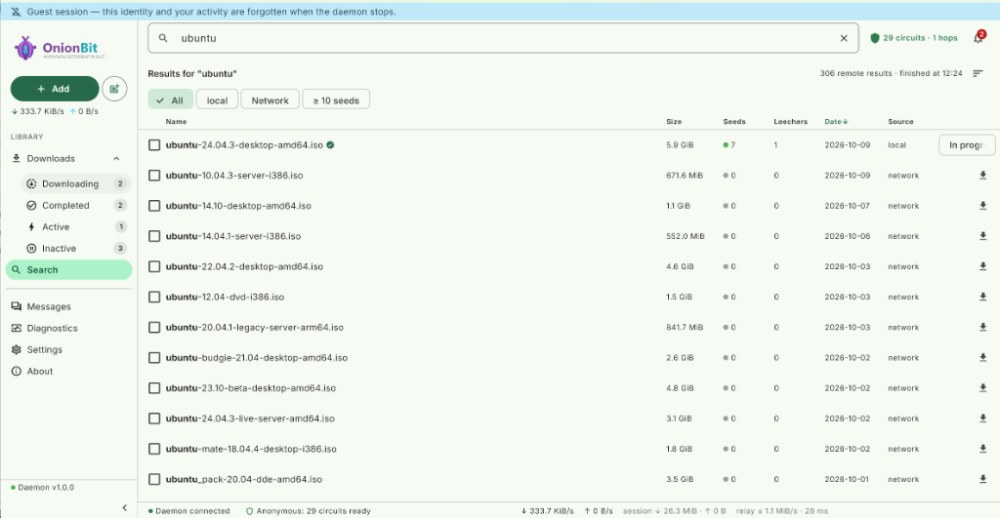
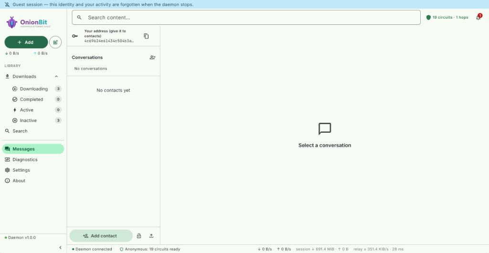
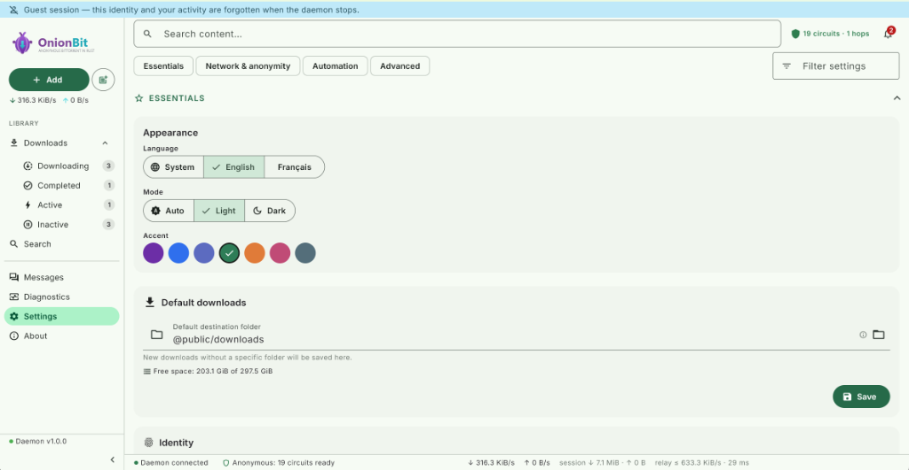
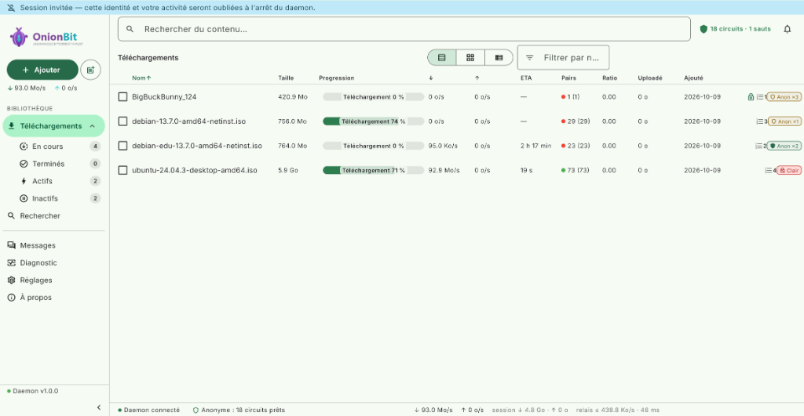

<div align="center">


### Anonymous, censorship-resistant peer-to-peer ecosystem

**One network, no servers: share files, message privately and own a portable
identity — all over multi-hop onion circuits.**

[](LICENSE)
[](https://www.rust-lang.org/)
[](https://flutter.dev/)
[](https://github.com/laurentgeynet-ux/OnionBit/actions/workflows/ci.yml)
[](docs/interop/README.md)
[](https://github.com/laurentgeynet-ux/OnionBit/releases)
[](https://github.com/laurentgeynet-ux/OnionBit/pkgs/container/onionbit)
[]()

[Features](#the-fabric--one-shared-onion-network) ·
[Evidence](#proof-not-promises) ·
[Install](#getting-started) ·
[Screenshots](#screenshots) ·
[Security](#security-model) ·
[Docs](docs/INDEX.md)

</div>

---

## What is OnionBit?

OnionBit is a peer-to-peer ecosystem — a small network of equals with **no
central server, no account, no phone number**. Every node reaches the others
through **multi-hop onion circuits** (layered encryption where each relay
only knows its neighbors), and on top of that shared fabric run the
services: file sharing, messaging, trust and a portable identity.

| You want to… | OnionBit gives you |
| :--- | :--- |
| Download or seed without exposing your IP | BitTorrent over 3-hop onion circuits — hidden seeding included |
| Chat with zero servers, zero accounts | Signed, end-to-end encrypted messaging — 1-to-1 and groups, your public key is your address |
| Send a file inside a conversation | Anonymous swarm attachments, seeded only for your contacts |
| Carry your identity to a new device | One 24-word recovery phrase, or a password-sealed `OBID` export |
| Stay reachable under censorship | Stealth transport + Tor-style `onionbit-bridge://` invitation links |

OnionBit is written in Rust (memory-safe, single binary) with a
cross-platform Flutter UI — Windows, Linux, macOS, Android, iOS and Web.

## Proof, not promises

A README can only *claim* — the evidence lives in the repo. Every line in
this table is reproducible:

| Evidence | Where |
| :--- | :--- |
| ~580 Rust + ~85 Flutter automated tests, gated by `fmt`, `clippy -D warnings`, i18n lint, golden renders and **WCAG AA contrast checks** — one script runs them all | [`scripts/verify_all.ps1`](scripts/verify_all.ps1) + CI |
| **Bidirectional hidden-service transfers with unmodified Tribler 8.4.3** — 2- and 3-hop, kill/recovery, double integrity check (piece hashing + SHA-256) | [docs/interop](docs/interop/README.md) |
| **9/9 fingerprinting oracles PASS** — two real stealth daemons measured through a UDP tap: probing silence, amplification 0, zero static marker | [docs/security/fingerprinting.md](docs/security/fingerprinting.md) |
| Kill switch verified at the **OS packet level** — 4 injected-failure scenarios, zero forbidden traffic | [docs/P0-transport-manifest.md](docs/P0-transport-manifest.md) |
| Fuzzing campaign journal — what broke, how it was fixed | [docs/security/fuzz_journal.md](docs/security/fuzz_journal.md) |
| **25 Architecture Decision Records** — every non-obvious choice is written down, in the open | [docs/architecture/decisions](docs/architecture/decisions/) |
| Threat model written *before* the features, kept honest | [docs/THREAT-MODEL.md](docs/THREAT-MODEL.md) |

## The fabric — one shared onion network

Everything rides the same overlay: an IPv8-style peer network carrying
**multi-hop onion circuits**.

```
you ──▶ relay ──▶ relay ──▶ exit ──▶ destination
        each hop knows only its neighbors — never both endpoints
```

- **Multi-hop circuits** — up to 3 hops between you and your destination
- **Hidden services** — introduction and rendezvous points let a node be
  reachable (and seed) without publishing an IP
- **Serverless** — discovery runs on the overlay DHT and peers; bridges are
  ordinary nodes, not infrastructure to trust
- **One transport, many services** — file sharing, messaging and trust share
  the same circuits; nothing leaks to clearnet (kill switch, no fallback)

## Services

### 📁 File sharing — anonymous BitTorrent

- 🔗 **Multi-hop anonymous downloads** — up to 3 onion hops between you and
  the swarm; peers only ever see the exit node's address
- 🌱 **Hidden seeding** — serve content behind rendezvous circuits without
  exposing an address
- 🔍 **Decentralized search** — distributed `remote select` queries through
  the IPv8 overlay (Tribler wire-compatible `RemoteSelect`/`SelectResponse`),
  live results pushed over SSE, per-peer query budgets — no central index,
  no public DHT crawler ([ADR-0025](docs/architecture/decisions/0025-decouverte-contenu-recherche-distribuee-canaux.md))
- 📺 **Signed curated channels** — follow a curator's channel by its Ed25519
  public key; every entry is signature-verified against that key before it
  lands in your library (anti-poisoning). Publish your own channel: title,
  commits and signed tombstones are served to subscribers over the same
  protocol ([ADR-0025](docs/architecture/decisions/0025-decouverte-contenu-recherche-distribuee-canaux.md))
- 🥷 **Discovery in stealth too** — in `full` mode, search and channel sync
  ride inside generic signed `ENCAP` frames relayed by bridges/gateways:
  queried peers only see the relay, and no cleartext datagram ever leaves
  your node ([ADR-0025 §5](docs/architecture/decisions/0025-decouverte-contenu-recherche-distribuee-canaux.md))
- 🩺 **Internal health** — a `torrents_to_check`-style scanner refreshes
  seeder/leecher counts of local and channel torrents (anonymous swarms
  excluded by design)
- 🛡️ **Kill switch** — anonymous downloads never silently degrade to direct
  connections; tracker and DHT traffic stay inside the tunnel
- 🤝 **Tribler-compatible wire** — downloads and seeds interoperate with
  Tribler 8.x nodes (see [Interoperability](#proven-interoperability))

Anonymous circuits are optional: plain BitTorrent downloads also work when
you don't need anonymity — same engine, direct connections.

### 💬 Messaging — no server, your key is your address

OnionBit carries **end-to-end messaging over the same onion fabric** — an
OnionBit-only extension
([ADR-0011](docs/architecture/decisions/0011-messagerie-anonyme-e2e.md),
[ADR-0019](docs/architecture/decisions/0019-messagerie-conversations-groupes-fichiers.md)).
No server, no account, no phone number: **your public key is your address.**

```
        you                                            contact
         │  announce intro points on swarm                │
         │  messaging_hash(own_pk) ──────────► (DHT)      │
         │                                                │
         │  ◄─── resolve pk → intro point ──── connect(pk)
         │  ◄══════ create-e2e rendezvous circuit ════════►│
         │  ◄── hello lands in `pending` ─── accept ─────▶│
         │  ◄════════ signed, e2e-encrypted frames ════════►
```

- 🔑 **Identity = your IPv8 keypair** — an Ed25519 (`libnacl`) key derived
  from a root seed (`identity_seed.bin`, atomic writes, `0600` on Unix).
  Back it up once as a 24-word recovery phrase or move it between devices
  via the password-sealed `OBID` export (*Settings → Identity*), then
  restore your contacts with the `OBV1` vault.
  Sharing a contact means exchanging public keys, nothing else.
- 🧅 **Reachable without an IP** — each identity announces introduction
  points on its own hidden swarm (`messaging_hash(pk)`); contacts resolve it
  through DHT/PEX and open a rendezvous e2e circuit. Relays forward cells
  without learning who talks to whom.
- 🔐 **Two independent crypto layers** — the e2e handshake yields *transport*
  session keys; the application derives its own directional `send`/`recv`
  keys via HKDF-SHA256 (domain `"onionbit messaging v1"`). Compromising one
  layer does not unlock the other.
- ✍️ **Every frame signed** — versioned canonical bencode (32 KiB bound),
  Ed25519-signed by the sender and verified against the key that defines the
  swarm: nobody who merely knows the swarm can write in your name.
- ✋ **Consent before anything** — an unknown sender lands in a bounded
  `pending` queue: accept, refuse or block. No consent → no circuit → no
  delivery.
- 👥 **Group conversations** — roster-driven groups over the same e2e
  frames: invites only from contacts, additive roster sync, per-member
  delivery tracking
  ([ADR-0019](docs/architecture/decisions/0019-messagerie-conversations-groupes-fichiers.md))
- 📎 **File attachments** — any file becomes a salted torrent seeded in an
  anonymous swarm reachable only by the recipients; accept → anonymous
  download into your chosen area
  ([ADR-0019](docs/architecture/decisions/0019-messagerie-conversations-groupes-fichiers.md))
- 📬 **Honest delivery semantics** — offline contact ⇒ immediate visible
  `failed` state, never a silent queue. Contacts and messages persist
  locally in plaintext SQLite (endpoint compromise is outside the threat
  model); optional per-contact retention with real deletion
  (`secure_delete` wipes bodies before `DELETE`).

Toggle: *Settings → Anonymity → Anonymous messaging* (on by default; applied
on restart). REST surface: `GET/POST /api/messaging/*` + SSE events.

### 🪪 Portable identity — yours, on any device ([ADR-0016](docs/architecture/decisions/0016-identite-portable.md))

No account, no server — and your identity is no longer tied to one device
nor exposed as a bare file:

- 🌱 **One seed, one phrase** — a 32-byte root seed (`identity_seed.bin`)
  derives *everything* through domain-separated HKDF: your IPv8 keypair
  **and** your stealth bridge key. Back it up once as a **24-word BIP39
  recovery phrase** — official wordlists vendored in English *and* French,
  the decoder accepts both — and that phrase restores the complete identity
  on any device.
- 🚪 **No throwaway key on the wire** — on first launch, a UI-spawned daemon
  stops at an `identity_pending` gate: *create*, *restore* (phrase or
  `OBID`) or *go guest* **before any packet is signed**. Headless daemons
  still auto-generate — a bridge must never block unattended.
- 👻 **Guest sessions** — a fully ephemeral identity held in memory only:
  nothing is written to disk, history stays `:memory:`, and the identity
  ceases to exist on shutdown. Two guest sessions are unlinkable — at the
  cost of being a permanent stranger (no accumulated trust).
- 🔒 **Optional at-rest sealing** — encrypt the seed into an `OBSK` blob
  (argon2id RFC 9106 → ChaCha20-Poly1305) and the daemon boots `locked`:
  the API is up but nothing identity-bound runs until a rate-limited
  `unlock`. Refused on `bridge`/`gateway` roles — a bridge must reboot
  without supervision. Lost password → restore from the phrase.
- 🧓 **Existing installs unaffected** — legacy nodes keep their raw keypair
  (`seeded: false`); changing keys means a new identity, so re-keying is
  never forced.

Full spec and migration path:
[ADR-0016](docs/architecture/decisions/0016-identite-portable.md).

### 🤝 Trust & extensions — reputation without a blockchain ([ADR-0015](docs/architecture/decisions/0015-extensions-onionbit-legacy-tribler.md))

Wire compatibility with Tribler 8.x is a hard boundary: the legacy protocol is
**never modified**. Everything new lives in a dedicated extension community
(`OnionbitExtCommunity`, own community id) spoken **only between OnionBit
peers** — a Tribler node simply never hears it.

- 🙋 **Signed capability `hello`** — peers advertise feature bits
  (`CAP_OBF_V1`, `CAP_MSG_V1`, `CAP_MSG_V2`, …) in an Ed25519-signed
  handshake; a forged or replayed hello is rejected at the wire.
- ⭐ **Signed curator attestations** — any identity can `endorse`/`flag` a
  torrent or a peer (`kind=identity`); attestations gossip between OnionBit
  peers and feed a **local** trust score. Search results show trust badges and
  you can *follow curators* — reputation without a blockchain.
- 📒 **Bilateral signed ledger** — two peers can record mutual obligations
  (`PROPOSE` → `SEAL`, heads, rejects, fork proofs). It is *not* Tribler's
  retired TrustChain: no global state, no consensus, just signed
  accounting between two endpoints — groundwork against free-riding.
- 🕶️ **`OBF` padded envelopes** — opt-in encrypted wrapping of extension frames
  (HKDF `ext-obf/v1`, size-class padding) negotiated via `CAP_OBF_V1`;
  content *and* shape hidden from a passive observer, never sent to legacy peers.
- 🤝 **Trust-gated messaging** — optional consent gates: auto-admit endorsed
  contacts, drop flagged ones, refuse tunnel debtors (`messaging_consent_*`,
  all off by default). Local blocks always win.
- 📇 **Encrypted contact vault (`OBV1`)** — export your contact list (public
  keys + local aliases) sealed to *your own* key; restore on another device.
  Nothing public, nothing on a server.
- 🧳 **Portable identity (`OBID`)** — export/import the identity key as an
  argon2id + ChaCha20-Poly1305 sealed blob — or back up the root seed as a
  24-word BIP39 phrase that regenerates keypair *and* stealth bridge key;
  `restart_required` swap, no account needed
  ([ADR-0016](docs/architecture/decisions/0016-identite-portable.md)).

Discovery: `GET /api/ipv8/ext` lists OnionBit peers with full public keys —
the messaging UI suggests `msg_v1` peers you haven't added yet. Full spec:
[ADR-0015](docs/architecture/decisions/0015-extensions-onionbit-legacy-tribler.md).
For anti-censorship — traffic with *no static protocol marker at all* — see
the dedicated [stealth mode](#stealth--censorship-resistance-by-design-adr-0017).

### 🥷 Stealth — censorship resistance by design ([ADR-0017](docs/architecture/decisions/0017-transport-furtif-anti-censure.md))

`OBF` hides the *content* of extension frames — but a classifying censor can
still recognize "OnionBit" from the very first datagram. **Stealth mode
removes every static protocol marker**: no community prefixes, no cleartext
keys or signatures, no recognizable handshake — a transport measured against
fingerprinting oracles, not merely declared stealthy.

Stealth is a **dedicated, opt-in mode**: stealth and legacy Tribler interop
cannot coexist on one node (legacy walk traffic would betray the protocol),
and hybrid configs are refused at startup on every path. The network runs
on three roles:

| Role | What it does |
| :--- | :--- |
| `client` | the censored node — all cleartext interfaces off, only the morphed transport toward bridges |
| `bridge` | entry gate — accepts stealth handshakes; its `onionbit-bridge://` invitation link is distributed out-of-band |
| `gateway` | stealth transport **plus** public BitTorrent exit — the role that makes the global swarm reachable from inside the censored zone |

- 🎫 **Bridge invitation links** — `onionbit-bridge://<ip>:<port>#<bridge_pk>`,
  shared out-of-band like Tor bridges. The bridge key serves admission and
  anti-probing; your OnionBit identity is only revealed *inside* the
  authenticated tunnel.
- 🌀 **No static wire marker** — an `ntor`-style authenticated handshake in
  the very first datagram; ephemeral X25519 keys travel as **Elligator2
  representatives** (indistinguishable from uniform randomness); frame
  counters masked inside the AEAD; additive padding clamped under a
  1280-byte MTU so nothing fragments.
- 🧱 **Uniform silence under probing** — malformed, forged or replayed
  datagrams get *zero* response, whatever the cause (no probing oracle),
  with amplification strictly ≤ 1 and pre-DH CPU budgets both per-IP and
  global.
- 🔁 **Handshake anti-replay** — authenticated timestamps (±90 s window)
  plus a bounded sliding filter of seen ephemeral keys: a captured first
  datagram can never force a response.
- 🛡️ **Fail-closed kill switch** — never a cleartext datagram, even on
  packet loss, timeouts, NAT rebinding or session expiry. Optional random
  cover traffic smooths idle periods.
- 🐌 **Anti-scraping peer discovery** — bridges introduce stealth peers via
  `INTRO` messages *inside* the tunnel, in a graduated sequence: a seed
  budget for newcomers, expansion gated on bilateral ledger reputation —
  one leaked link cannot enumerate the bridge network.
- 📡 **Everything still works inside** — onion circuits, hidden seeding,
  e2e messaging and the whole [ADR-0015](docs/architecture/decisions/0015-extensions-onionbit-legacy-tribler.md) extension layer run unchanged over
  the morphed transport — and content discovery itself is relayed to bridges
  inside generic `ENCAP` frames ([ADR-0025](docs/architecture/decisions/0025-decouverte-contenu-recherche-distribuee-canaux.md)).
  Only clearnet discovery, the public DHT and direct BitTorrent are off
  (public exit exists only on `gateway`).

Validated by measurement, not decree: `bench_stealth_fingerprint.ps1` runs
two real stealth daemons through a UDP tap proxy — **9/9 oracles PASS**
(probing silence, amplification 0, zero legacy marker or constant prefix,
≈8 bits/byte entropy, sessions surviving floods, impairments, bridge
restarts and port rebinding). Honest limits: traffic *volume* stays a
signal, blanket UDP throttling breaks the transport, and distributing the
first bridge link remains a social problem — see
[ADR-0017](docs/architecture/decisions/0017-transport-furtif-anti-censure.md)
and [docs/security/fingerprinting.md](docs/security/fingerprinting.md).

### 🎚️ Privacy profiles — one switch, three postures ([ADR-0022](docs/architecture/decisions/0022-profils-anonymat.md))

Your anonymity posture is not one setting — it is a combination of ~20
keys scattered across `configuration.json`. So OnionBit materializes it as
a **three-position switch** in the sidebar (and inside the Privacy HUD on
compact layouts): one control, the whole regime.

| Profile | Posture |
| :--- | :--- |
| **Compatible** (`legacy`) | Today's defaults — interop with the Tribler 8.x network: cleartext IPv8 mesh, anonymous downloads at 1 hop, e2e messaging, guard nodes, OnionBit extension community on the wire (peers recognize each other), measured-not-enforced ledger, public download zone |
| **Full anonymous** (`full`) | **OnionBit↔OnionBit only** — the stealth transport replaces the whole legacy wire: morphed traffic with zero static marker, cover traffic, 3 hops on downloads *and* messaging, encrypted private storage zone by default (ADR-0018), enforced contribution ledger. Tribler interop is sacrificed by design |
| **Custom** (`custom`) | Free combination, edited key-by-key in Settings — also displayed automatically the moment one covered key diverges from the stored preset |

- 🌐 **Full anonymous depends on the deployed OnionBit network.** It is
  only as real as the stealth fleet it joins: a stealth `client` cannot
  reach anything without at least one `bridge`, and only `gateway` nodes
  offer an exit toward the public BitTorrent swarm. No deployed
  bridges/gateways → an empty enclave, however strong the transport.
  That's a hard prerequisite, not a warning: switching to `full` without
  a `onionbit-bridge://` link is **refused** (`409 missing_prerequisites`)
  and the UI offers to paste an invitation inline instead.
- 🧾 **A preset is materialized, not layered** — picking a profile rewrites
  the covered keys atomically through the same merge path as
  `POST /api/settings` (all-or-nothing, validated). The displayed profile
  is *derived*: edit a covered key and the badge honestly falls back to
  « Custom », listing the diverged keys.
- 🔁 **A wire regime needs a restart** — `legacy ↔ full` flips
  `ipv8.enabled × stealth.enabled` together (the hybrid is refused on
  every path, not just at boot); `restart_required` triggers the one-click
  restart flow on local daemons, manual guidance on remote ones.
- 🚫 **Never touched by a preset** — `stealth.bridges`, `identity.at_rest`
  (recommended via the UI, never forced — sealing needs its own password
  flow, ADR-0016), ports, API keys, and the hop counts of downloads
  already running. Guest sessions see the switch read-only: a guest
  writes nothing into your real `configuration.json`.

Honest wording, as always: « Full anonymous » means *OnionBit-only,
unclassifiable wire traffic* — volume and timing remain observable
signals, and the mode is only as strong as the stealth network it joins.

## Honest limits

> **Status: stable — v1.1.2.** The engine is validated against the real
> Tribler network (Tribler 8.x interop testbench) — including fail-closed
> transport under injected failures (see `docs/P0-transport-manifest.md`).
> That said, no anonymity tool has had an independent audit here yet:
> keep the usual caution for high-stakes use. Onion routing reduces
> network-level linkability; it does not eliminate all privacy risks —
> see the [threat model](docs/THREAT-MODEL.md).
>
> Stealth mode removes static protocol markers — not traffic volume or
> timing; distributing a first bridge link remains a social problem
> ([ADR-0017](docs/architecture/decisions/0017-transport-furtif-anti-censure.md)
> §Limites).

## Proven interoperability

OnionBit has completed **bidirectional hidden-service transfers with unmodified
Tribler 8.4.3**:

- Tribler downloads from an OnionBit anonymous seeder — and vice versa.
- Controlled **2-hop and 3-hop** transfers completed in both directions.
- Seeder, introduction-point and bootstrap-node **kill/recovery scenarios**
  completed with verified content integrity.
- Real-network downloads over live Tribler relays and the public DHT.

Every transfer is checked twice: BitTorrent piece hashing, then an independent
SHA-256 of the received file. Full scenario table, failure semantics and
reproduction scripts: [**interoperability evidence**](docs/interop/README.md).

*Born as a Rust port of [Tribler](https://github.com/Tribler/tribler),
OnionBit grew into its own ecosystem — still wire-compatible with the
Tribler 8.x network.*

## Screenshots

| Downloads — anonymous swarms, per-torrent hop badges | Diagnostics — live circuits, relays & exits |
| :---: | :---: |
|  |  |

| Decentralized search — trust badges, seed filters | Messaging — serverless e2e conversations |
| :---: | :---: |
|  |  |

| Settings — categories, accents, free space | Light mode & French UI |
| :---: | :---: |
|  |  |

*Real captures of v1.0.0 — adaptive shell, dark/light themes, English and
French (System / English / Français in Settings → Appearance).*

## Architecture

```
┌─────────────────┐  ┌──────────────┐  ┌────────────────────┐
│  Flutter UI     │  │     CLI      │  │  3rd-party tools   │
│  (all platforms)│  │              │  │                    │
└────────┬────────┘  └──────┬───────┘  └─────────┬──────────┘
         └──────────────────┼────────────────────┘
                            │ REST + SSE (loopback by default)
┌───────────────────────────▼────────────────────────────────┐
│                    Control plane (axum)                    │
├────────────────────────────────────────────────────────────┤
│  Domain core — sessions, discovery, messaging, settings    │
├──────────────┬──────────────┬───────────────┬──────────────┤
│ BitTorrent   │ IPv8 overlay │ Tunnel comm.  │ SQLite store │
│ (librqbit)   │              │ (onion rout.) │              │
├──────────────┴──────────────┴───────────────┴──────────────┤
│  Network policy — anti-SSRF · exit policy · kill switch    │
└────────────────────────────────────────────────────────────┘
```

- **BitTorrent engine** — built on [librqbit](https://github.com/ikatson/rqbit) (Apache-2.0):
  bencode, peer-wire, mainline DHT (BEP 5), uTP, trackers.
- **Anonymity layer** — an implementation of `pyipv8` + `TunnelCommunity`
  semantics: overlay discovery, onion circuits, hidden services, verified
  against live Tribler nodes.
- **Control plane** — REST + SSE API on loopback by default; the UI, CLI and any
  third-party tool all go through the same door.
- **UI** — Flutter, one codebase for Windows, Linux, macOS, Android, iOS and Web.
  The web build is served **same-origin by the daemon itself**
  (`http://127.0.0.1:<port>/`, [ADR-0012](docs/architecture/decisions/0012-interface-web-same-origin.md)) — same UI in your browser, no CORS,
  `/api/*` still behind the API key.

## Getting started

> Prebuilt packages are on the
> [Releases](https://github.com/laurentgeynet-ux/OnionBit/releases) page:
>
> - **Windows x64** — `OnionBit-*-windows-x64.zip`: unzip anywhere,
>   double-click **`OnionBit`** at the bundle root — the native UI starts
>   the daemon itself. Two siblings sit next to it: `OnionBit Web` (same UI
>   in your browser at `http://127.0.0.1:8085/`) and `OnionBit Daemon`
>   (backend alone, console + tray). Fully portable: `state\` and `data\`
>   live beside the launchers — carry the folder, keep your identity.
> - **Windows ARM64** — `OnionBit-*-windows-arm64-headless.zip`: daemon + CLI +
>   web UI (headless — no native Flutter ARM64 build yet).
> - **Linux x64** — `onionbit_*_amd64.deb` (Debian/Ubuntu/Mint): installs
>   application-menu entries (OnionBit → web UI, OnionBit Daemon → console),
>   icons, `onionbit-daemon`/`onionbit-cli` in PATH and a `systemd --user`
>   unit. Per-user state lands in `~/.local/share/onionbit` — no root
>   needed. Or use the `*-linux-x64.tar.gz` portable tarball.
>
> - **Android** — `OnionBit-*-android-<abi>.apk` (arm64-v8a, armeabi-v7a,
>   x86_64): the app is a **remote client** — pair it to a running daemon
>   by QR code, no engine embedded. Built and signed in CI (release
>   keystore); APKs land in the release assets on the next `v*` tag.
>
> **Docker** — `ghcr.io/laurentgeynet-ux/onionbit:v1.1.2` (and `:latest`):
>
> ```bash
> # headless daemon, one persistent volume, P2P on the host network
> docker run -d --name onionbit --network host \
>   -v ./data:/data --restart unless-stopped \
>   ghcr.io/laurentgeynet-ux/onionbit:latest
>
> docker exec onionbit onionbit-cli status   # healthcheck + control
> ```
>
> One image serves every role — pick the posture at first boot:
> `docker run -e ONIONBIT_PROFILE=bridge …` starts a full-anonymous
> stealth bridge (ADR-0022 §7), `-e ONIONBIT_PROFILE=full` a stealth
> client, omitting it keeps the Tribler-compatible `legacy` default.
> The image ships the daemon, the CLI and the **web UI** (served
> same-origin); the control API stays loopback-locked inside the
> container — expose it deliberately via `network_mode: host` or the
> documented forwarder sidecar, never via a public port.
> Full guide — profiles, ports, volumes, bridge recipe, security
> notes: [docs/docker.md](docs/docker.md) · [ADR-0024](docs/architecture/decisions/0024-image-docker-daemon.md).
>
> Other platforms (macOS, Android, iOS): build from source
> (see [docs/BUILDING.md](docs/BUILDING.md)).

### Platform status — what ships today

| Platform | Status |
| :--- | :--- |
| Windows x64 | ✅ packaged portable bundle — native UI + daemon + CLI + web UI |
| Windows ARM64 | ✅ packaged zip — headless (daemon + CLI + web UI) |
| Linux x64 | ✅ `.deb` with menu entries + systemd unit, and portable tarball |
| Web | ✅ same UI served same-origin by the daemon on every platform |
| Docker | ✅ image on ghcr.io (`:v1.1.2`, `:latest`) — daemon + CLI + web UI, all profiles via `ONIONBIT_PROFILE` |
| macOS / iOS | 🔨 builds from source — runners ready, needs a signed Mac build host |
| Android | ✅ APK packagé en CI — client distant, pairage QR vers un daemon (`OnionBit-*-android-*.apk`) |
| Linux native UI | 📋 runner scaffolded — packaged path is the web UI today |

**Prerequisites:** Rust stable, Flutter stable (UI only).

```bash
# Daemon (control plane + engine)
cargo build --release -p onionbit-daemon
./onionbit-daemon

# CLI
cargo run -p onionbit-cli -- downloads list

# Flutter UI
cd app && flutter run -d windows   # or linux / chrome / android
```

The daemon exposes `http://127.0.0.1:8085` (loopback only by default) — the same
endpoint the UI and CLI consume. Full build & packaging notes:
[docs/BUILDING.md](docs/BUILDING.md).

## Security model

Anonymity tooling fails quietly. OnionBit treats leak prevention as a hard invariant:

- **No clearnet fallback** — anonymous downloads never silently degrade to direct connections
- **Kill switch** — traffic halts when circuits collapse
- **Stealth kill switch** — in stealth mode, *no cleartext datagram ever leaves
  the socket*, even on loss, timeout, NAT rebinding or session expiry
- **Probing resistance** — stealth nodes answer unauthenticated traffic with
  uniform silence; response amplification is capped at ≤ 1
- **Anti-SSRF & loopback isolation** — the API cannot be coerced into reaching internal services
- **Exit policy enforcement** — exit nodes honor a strict policy
- **Sandboxed trackers/DHT** — in anonymous mode, tracker and DHT traffic rides inside the tunnel

See [SECURITY.md](SECURITY.md) for reporting and the threat model.

## Roadmap

**File sharing**

- ✅ BitTorrent engine (librqbit integration)
- ✅ Onion circuits + hidden seeding
- ✅ Live interop with Tribler 8.x nodes
- ✅ Distributed content discovery — remote select, SSE live results, per-peer
  budgets, internal health scan ([ADR-0025](docs/architecture/decisions/0025-decouverte-contenu-recherche-distribuee-canaux.md))
- ✅ Signed curated channels — Ed25519 channel feeds, verified ingestion,
  personal channel publishing ([ADR-0025](docs/architecture/decisions/0025-decouverte-contenu-recherche-distribuee-canaux.md))
- ✅ Stealth-relayed discovery — generic `ENCAP` frames through bridges, no
  cleartext discovery in `full` mode ([ADR-0025](docs/architecture/decisions/0025-decouverte-contenu-recherche-distribuee-canaux.md))

**Messaging & identity**

- ✅ Anonymous e2e messaging over hidden services ([ADR-0011](docs/architecture/decisions/0011-messagerie-anonyme-e2e.md))
- ✅ Multi-conversation messaging: tabs, groups, file attachments ([ADR-0019](docs/architecture/decisions/0019-messagerie-conversations-groupes-fichiers.md))
- ✅ OnionBit extension layer: signed hello, attestations, ledger, OBF ([ADR-0015](docs/architecture/decisions/0015-extensions-onionbit-legacy-tribler.md))
- ✅ Trust-gated messaging + `OBV1` contact vault ([ADR-0015 §9](docs/architecture/decisions/0015-extensions-onionbit-legacy-tribler.md))
- ✅ Seed identity: HKDF root seed + 24-word BIP39 phrase (EN/FR), guest & locked modes, `OBID` ([ADR-0016](docs/architecture/decisions/0016-identite-portable.md))
- ✅ Mobile pairing by QR — short-lived one-time token, `POST /api/pairing/*` (rate-limited, single-use)

**Stealth & anti-censorship**

- ✅ Stealth transport: morphed wire format, bridge links, anti-probing & anti-scraping ([ADR-0017](docs/architecture/decisions/0017-transport-furtif-anti-censure.md))
- ✅ Privacy profiles — one-switch `legacy`/`full`/`custom` posture, server `bridge`/`gateway` variants ([ADR-0022](docs/architecture/decisions/0022-profils-anonymat.md))
- ✅ OnionBit-only stealth network deployed — 3 full-anonymous bridge bootnodes in a live mesh (reference deployment, ADR-0024 §8)

**Platform**

- ✅ IPv8 overlay (discovery, communities, DHT)
- ✅ REST + SSE control plane, CLI
- ✅ Flutter UI — adaptive shell (compact → large), touch + keyboard + mouse,
  self-hosted fonts, design system with golden tests
- ✅ Web UI served by the daemon (same-origin)
- ✅ In-app update check (GitHub releases probe)
- ✅ Latest release: [`v1.1.2`](https://github.com/laurentgeynet-ux/OnionBit/releases)
- ✅ Windows portable bundle — three root launchers (UI / web / daemon)
- ✅ Linux `.deb` — menu entries, icons, `systemd --user` unit, XDG state dir (+ portable tar.gz)
- ✅ Windows ARM64 package (headless)
- ✅ Docker image — daemon + CLI + web UI on ghcr.io, `--profile`/`ONIONBIT_PROFILE` first-boot presets ([ADR-0024](docs/architecture/decisions/0024-image-docker-daemon.md))
- ✅ Android APK — remote client pairing to a daemon over QR
- 📋 iOS package
- 📋 macOS package, native Linux UI

## Contributing

Contributions welcome — see [CONTRIBUTING.md](CONTRIBUTING.md). Big-ticket items:
IPv8 protocol conformance, circuit crypto, Flutter UI, interop testing.

## Acknowledgements

- **[Tribler](https://github.com/Tribler/tribler)** — the original anonymous BitTorrent
  client (Delft University of Technology). OnionBit reimplements its
  architecture and protocols in Rust; no Python source is copied verbatim.
- **[librqbit / rqbit](https://github.com/ikatson/rqbit)** — the excellent Rust
  BitTorrent engine underneath.
- **[pyipv8](https://github.com/Tribler/py-ipv8)** — reference implementation of the
  IPv8 overlay protocol.

## License

Copyright (C) 2026 Laurent Geynet ([laurent.geynet@gmail.com](mailto:laurent.geynet@gmail.com))

[GPL-3.0-or-later](LICENSE) — inherited from Tribler. OnionBit is a derivative work
of Tribler's GPL-3.0 codebase at the architecture/behavior level.

---

<div align="center">
<b>OnionBit</b> — peel the layers, not your privacy. 🧅
</div>
